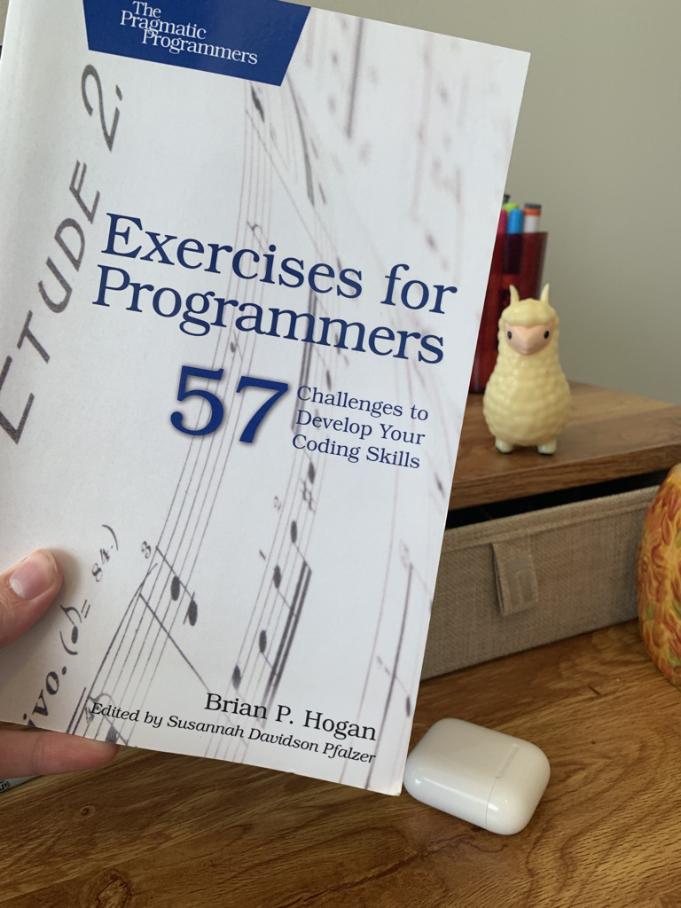

# Project Title

## Table of Contents

[Description](#description)  
[Technologies](#technologies)  
[Installation](#installation)  
[Usage](#usage)  
[Links](#links)  
[Credits](#credits)  
[License](#license)  
[Questions](#questions)

## Description

The purpose of this repo is to track my progress through the exercises found in the book _Exercises for Programmers: 57 Challenges to Develop Your Coding Skills_ by Brian P. Hogan. I am finding ways to continue to strengthen my skillset as a software engineer and specifically focusing on test-driven development (TDD) here, writing tests for each exercise using the Jest framework. Thanks for stopping by!



## Technologies

- Jest
- JavaScript
- HTML

## Installation

Clone and/or fork the repo, (see how [here](https://docs.github.com/en/desktop/contributing-and-collaborating-using-github-desktop/cloning-and-forking-repositories-from-github-desktop)). Be sure to install any project dependencies by running the following in your command line:

```bash
npm --i
```

## Usage


## Links

- [GitHub Pages](https://emblair96.github.io/57-challenges-with-jest/)

## Credits

-

## License

Copyright &copy; 2021 Emily Blair. Licensed under the MIT license.

## Questions

Contact me at emilyblair96@gmail.com with questions. If you find something that could be improved about this application, you can submit an issue on GitHub [https://github.com/emblair96](https://github.com/emblair96).
